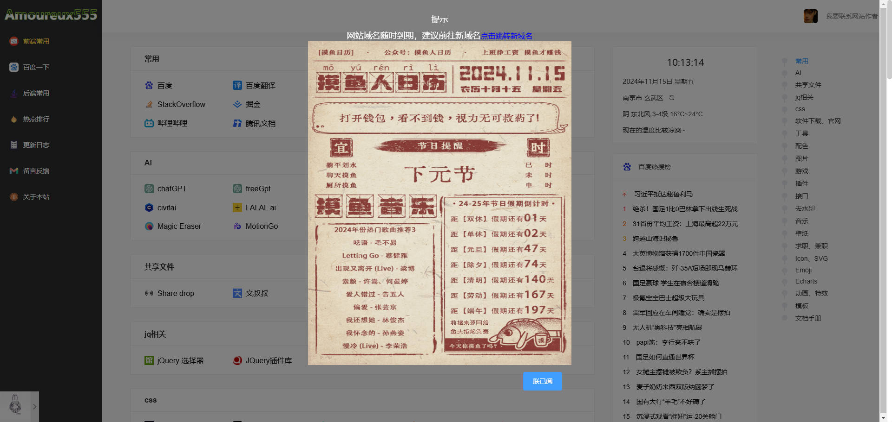
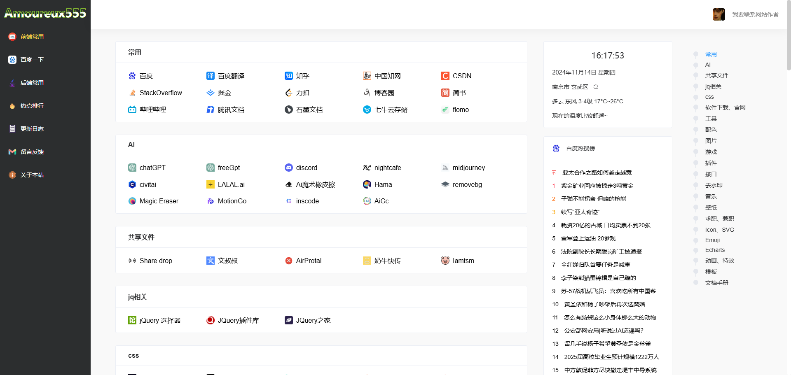

# devtools
## 工具箱 基于vue2发开,写的不好大佬轻点喷,欢迎指点






## 安装依赖

```
npm install
```

### 运行项目
```
npm run serve
```

### 打包项目
```
npm run build
```

### 代码规范

```
npm run lint
```

### 技术栈
- Vue2
- vuex
- Js
- element-ui

